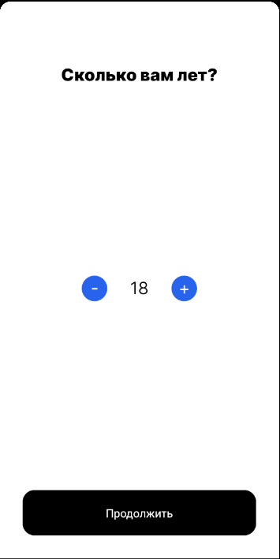
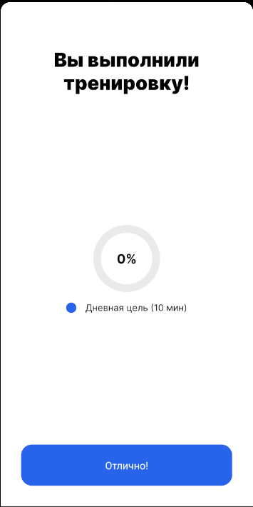

## VisionUs: React Native Vision Exercise Application

### Description

VisionUs is an application designed to improve visual health and eye performance. The app provides a set of exercises and workouts specially designed to enhance vision and reduce eye strain during prolonged screen time.

### Features

- **Vision Exercises**: The application offers various exercises to relax and improve eye function, including focusing exercises, eye muscle relaxation, and more.

- **Firebase Integration**: Data about workouts and user status is stored in Firestore.

### Screenshots

